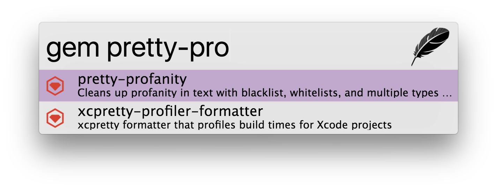

# zazu-rubygems

> [Zazu](https://github.com/tinytacoteam/zazu) plugin to search for gems with [rubygems.org](https://rubygems.org)

[](https://travis-ci.org/danielbayerlein/zazu-rubygems)
[](https://codecov.io/gh/danielbayerlein/zazu-rubygems)

## Usage

To use it simply type `gem` then the name of the package to search for.
For example `gem middleman`.



## Install

Add `danielbayerlein/zazu-rubygems` inside of `plugins` block of your `~/.zazurc.json` file.

```json
{
  "plugins": [
    "danielbayerlein/zazu-rubygems"
  ]
}
```

## License

Copyright (c) 2017 Daniel Bayerlein. See [LICENSE](./LICENSE.md) for details.
